# Bài thực hành: Lập trình Python với MQTT

## Broker sử dụng
- **Broker công cộng**: `broker.hivemq.com`  
- **Port**: `1883`  
- Không cần đăng nhập (anonymous).

---

## Cài đặt thư viện

```bash
pip install paho-mqtt
```

---

## Cách chạy từng chương trình

### Bài 1 – Gửi và nhận thông điệp cơ bản

Mở **2 terminal riêng biệt**:

**Terminal 1 – Subscriber:**
```bash
python subscriber_bai1.py
```

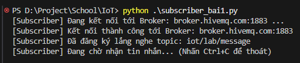

**Terminal 2 – Publisher:**
```bash
python publisher_bai1.py
```

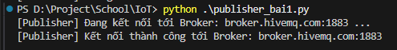

**KẾT QUẢ**

**Publisher:** (Có thể gửi nhiều lần tùy biến của vòng lặp)

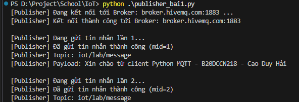

**Subscriber:** (Đã dừng chương trình bằng Ctrl + C)

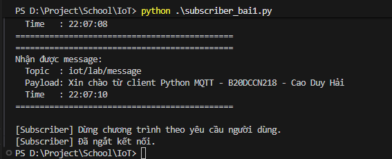

---

### Bài 2 – Mô phỏng cảm biến nhiệt độ & độ ẩm

Mở **2 terminal riêng biệt**:

**Terminal 1 – Monitor Subscriber:**
```bash
python monitor_subscriber_bai2.py
```

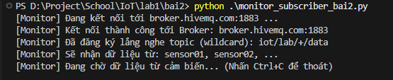

**Terminal 2 – Sensor Publisher:**
```bash
python sensor_publisher_bai2.py
```

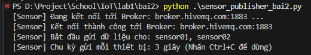

**KẾT QUẢ**

**Sensor Publisher:** (Nhiều sensor + Thông tin cách nhau từng dòng)

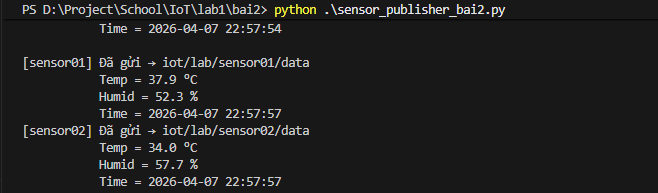

**Monitor Subscriber:** (Có cảnh báo nhiệt độ cao, độ ẩm thấp)

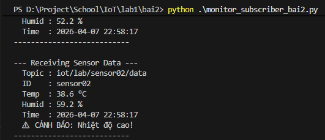

---

### Bài 3 – Hệ thống điều khiển đèn thông minh

Mở **2 terminal riêng biệt**:

**Terminal 1 – Smart Light Device:**
```bash
python device_bai3.py
```

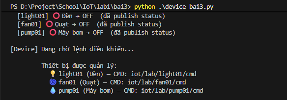

**Terminal 2 – Controller App:**
```bash
python controller_bai3.py
```

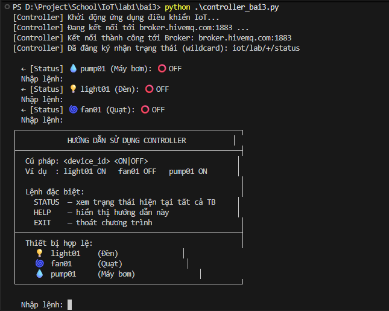

Nhập lệnh vào Terminal 2:
- `ON` — bật đèn

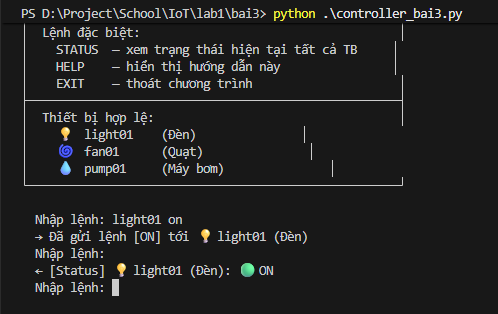

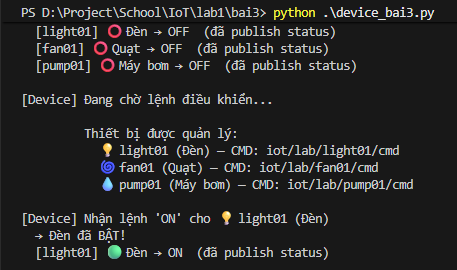

- `OFF` — tắt đèn

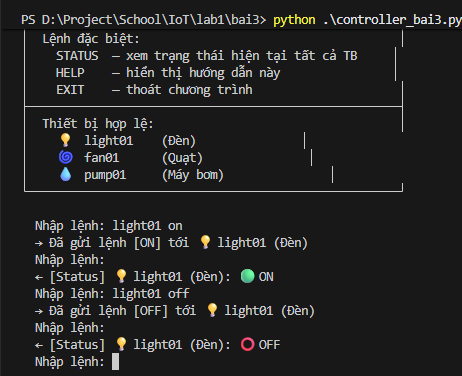

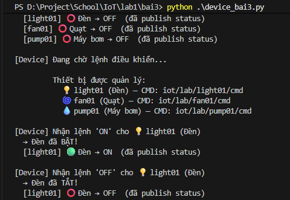

- `EXIT` — thoát chương trình

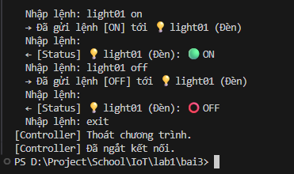

---

## Kết quả đạt được

| Bài | Chức năng | Kết quả |
|-----|-----------|---------|
| Bài 1 | Publish/Subscribe cơ bản | Publisher gửi thông điệp định danh SV; Subscriber nhận và hiển thị topic, payload, thời gian |
| Bài 2 | Mô phỏng cảm biến IoT | Dữ liệu JSON (nhiệt độ, độ ẩm) cập nhật mỗi 3 giây; cảnh báo đúng ngưỡng |
| Bài 3 | Điều khiển 2 chiều | Controller gửi lệnh ON/OFF; Device phản hồi trạng thái JSON; hỗ trợ lệnh EXIT |

---

## Cấu trúc file

```
lab1/
├── bai1/
│   ├── publisher_bai1.py          # Bài 1 – Publisher
│   └── subscriber_bai1.py         # Bài 1 – Subscriber
├── bai2/
│   ├── sensor_publisher_bai2.py   # Bài 2 – Sensor Publisher
│   └── monitor_subscriber_bai2.py # Bài 2 – Monitoring Subscriber
├── bai3/
│   ├── device_bai3.py             # Bài 3 – Smart Device Simulator
│   └── controller_bai3.py         # Bài 3 – Controller App
└── README.md                      # File hướng dẫn này
```
