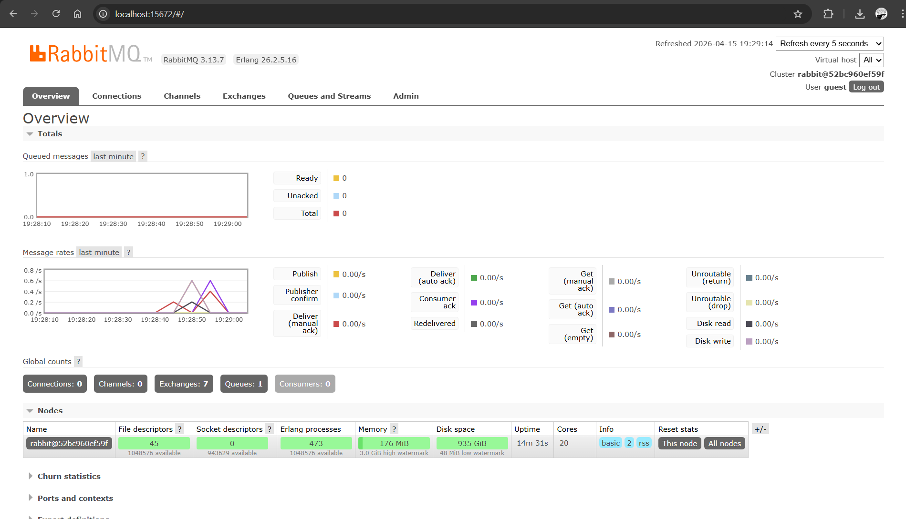
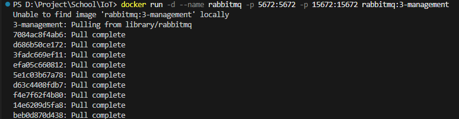
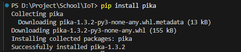
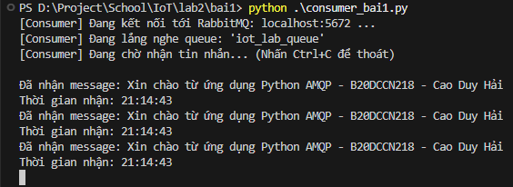
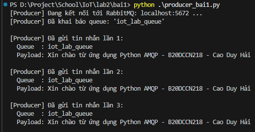
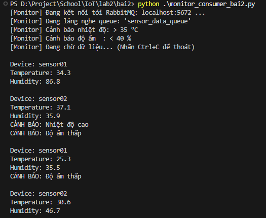
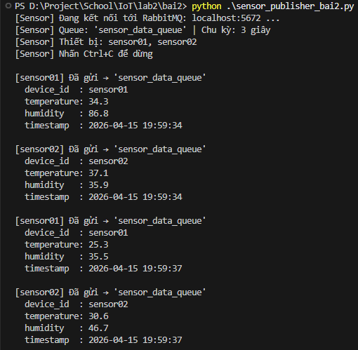
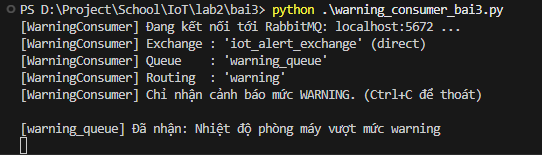
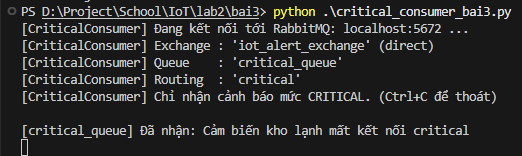
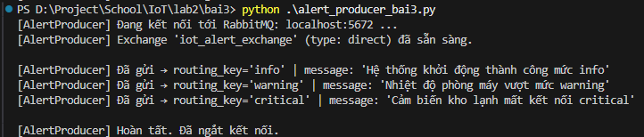

# Bài thực hành: Lập trình Python với AMQP (RabbitMQ)

## Broker sử dụng
- **Broker cục bộ**: RabbitMQ chạy trên `localhost`
- **Port**: `5672` (AMQP mặc định)
- **Management UI**: `http://localhost:15672` (user: `guest` / pass: `guest`)



---

## Cài đặt

### 1. Cài RabbitMQ
Ở đây em dùng Docker ạ
```bash
docker run -d --name rabbitmq -p 5672:5672 -p 15672:15672 rabbitmq:3-management
```



### 2. Cài thư viện Python
```bash
pip install pika
```



---

## Quy trình chạy từng chương trình

### Bài 1 – Gửi và nhận thông điệp cơ bản (Direct Queue)

Mở **2 terminal riêng biệt**:

**Terminal 1 – Consumer:**
```bash
cd bai1
python consumer_bai1.py
```

**Terminal 2 – Producer:**
```bash
cd bai1
python producer_bai1.py
```

**Kết quả mong đợi:**
- Producer gửi 3 tin nhắn vào queue `iot_lab_queue`
- Consumer nhận, in nội dung và thời gian nhận, chạy liên tục đến Ctrl+C





---

### Bài 2 – Mô phỏng cảm biến IoT (JSON Queue)

Mở **2 terminal riêng biệt**:

**Terminal 1 – Monitor Consumer:**
```bash
cd bai2
python monitor_consumer_bai2.py
```

**Terminal 2 – Sensor Publisher:**
```bash
cd bai2
python sensor_publisher_bai2.py
```

**Kết quả mong đợi:**
- Sensor Publisher gửi JSON `{ device_id, temperature, humidity, timestamp }` vào queue `sensor_data_queue` mỗi **3 giây**
- Monitor Consumer nhận, in ra `Device / Temperature / Humidity` và cảnh báo:
  - Nhiệt độ > **35 °C** → `CẢNH BÁO: Nhiệt độ cao`
  - Độ ẩm < **40 %** → `CẢNH BÁO: Độ ẩm thấp`





---

### Bài 3 – Hệ thống điều phối cảnh báo IoT với Direct Exchange

Bài 3 gồm **3 chương trình** chạy đồng thời.  
**Exchange `iot_alert_exchange` (Direct)** định tuyến message đến đúng queue theo **routing key**.

Mi nhắt:
- `info` → không consumer nào nhận
- `warning` → chỉ `warning_queue` nhận
- `critical` → chỉ `critical_queue` nhận

Mở **3 terminal riêng biệt**:

**Terminal 1 – Warning Consumer:**
```bash
cd bai3
python warning_consumer_bai3.py
```

**Terminal 2 – Critical Consumer:**
```bash
cd bai3
python critical_consumer_bai3.py
```

**Terminal 3 – Alert Producer:**
```bash
cd bai3
python alert_producer_bai3.py
```

**Kết quả mong đợi:**
- Alert Producer gửi 3 cảnh báo với routing key `info`, `warning`, `critical`
- **Warning Consumer** (`warning_queue`) chỉ nhận message có routing key `warning`
- **Critical Consumer** (`critical_queue`) chỉ nhận message có routing key `critical`
- Message `info` không được consumer nào nhận







---

## Cấu trúc file

```
lab2/
├── bai1/
│   ├── producer_bai1.py              # Bài 1 – Producer (gửi trực tiếp vào queue)
│   └── consumer_bai1.py              # Bài 1 – Consumer (nhận và xử lý)
├── bai2/
│   ├── sensor_publisher_bai2.py      # Bài 2 – Sensor Publisher (JSON mỗi 3 giây, field: device_id)
│   └── monitor_consumer_bai2.py      # Bài 2 – Monitor Consumer (cảnh báo ngưỡng)
├── bai3/
│   ├── alert_producer_bai3.py        # Bài 3 – Alert Producer (Direct Exchange)
│   ├── warning_consumer_bai3.py      # Bài 3 – Warning Consumer (routing key: warning)
│   └── critical_consumer_bai3.py     # Bài 3 – Critical Consumer (routing key: critical)
└── README.md                          # File báo cáo
```
